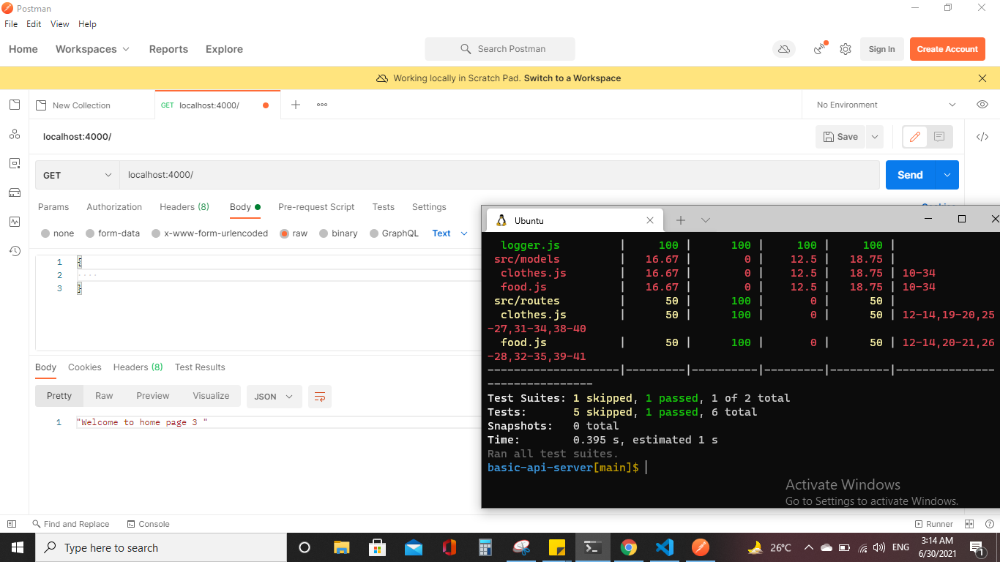

# Basic Api Server
### a REST Express API, has verious end points that perform CRUD operations, on a Mongo database, using REST standerds.

### Feature Requierments
* Creating two Routes ( food & clothes).
* Reading data from that routes.
* Adding Data for that routes.
* Update data
* Delete data
* Response body: JSON
## Tests & Deployment

### [Action](https://github.com/En-ZUH/basic-api-server/actions)
### [Heroku](https://basic-api-server-enas.herokuapp.com/) 
### [Pull Requests](https://github.com/En-ZUH/basic-express-server/pulls)

